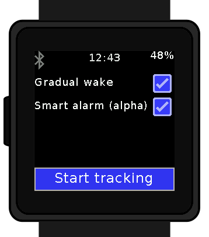

# SleepTk : a sleep tracker and smart alarm for wasp-os
**Goal:** privacy friendly sleep tracker with smart alarm for the [pinetime smartwatch](https://pine64.com/product/pinetime-smartwatch-sealed/) by Pine64, on python, to run on [wasp-os](https://github.com/daniel-thompson/wasp-os).

## Features:
* **Sleep tracking**: logs your body movement during the night, infers your sleep cycle and write it all down in a `.csv` file.
* **Heart tracking**: tracks your heart rate throughout the night.
* **Flexible**: does not make too many assumption regarding time to fall asleep, sleep cycle duration etc. SleepTk tries various data to see what fits best for your profile. If you still want to customize things, all the hardcoded and commented settings are easily accessible at the top of the file.
* **Privacy friendly**: your data is not sent to anyone, it is stored and analyzed directly on the watch (but you can still download it if needed).
* **Completely open source**
* **Best alarm time suggestion**: suggests wake up time according to average sleep cycles length.
* **Gradual wake**: vibrates the watch a tiny bit a few times before the alarm to lift you gently back to consciousness.
* **Easy to snooze but hard to stop** You have to swipe several times to make it stop, but can snooze easily.
* **Smart alarm clock (alpha)**: adaptative alarm that wakes you at the best time of your sleep cycle (up to 40 minutes before the set time) to make sure you wake up feeling refreshed.
* **Insomnia insights**: if you turn on the screen during the night, SleepTk will tell you how long you slept and in what part of the sleep cycle you are supposed to be.

## Credits:
* Many thanks to Emanuel Löffler (https://github.com/plan5) who kindly created the logo.

## **How to install**:
*(for now you need my slightly forked wasp-os that allows to use accelerometer data)*
* download the latest [forked wasp-os](https://github.com/thiswillbeyourgithub/wasp-os), or at least implement the relevant commits (624d1c675343cd4d95caea5ac4cec32766b3119b).
* download the latest [SleepTk.py](./SleepTk.py) and put it in `wasp-os/wasp/apps/SleepTk.py`
* open `SleepTk.py` to edit the user settings (at the top of the file)
* compile `wasp-os`: `make submodules && make softdevice && make BOARD=pinetime all && echo "SUCCESS"`
* upload it to your pinetime: `./tools/ota-dfu/dfu.py -z build-pinetime/micropython.zip -a XX:XX:XX:XX:XX:XX --legacy`
* reboot the watch and enjoy `SleepTk`
* *optional: download your latest sleep data using the script `pull_sleep_data.py`*
* *optional: delete all the sleep data present in your watch using the script `rm_sleep_data.py`*

### Note to reader:
* If you're interested or have any kind of things to say about this, **please** open an issue and tell me all about it :)
* Status as of end of May 2022: *UI (**done**), regular alarm (**done**), heart tracking (**done** but might be a bit dodgy), smart alarm (**mostly done but untested**)*
* you can download your sleep data file using the file `pull_sleep_data`. A suggested workflow to load it into [pandas](https://pypi.org/project/pandas/) can be found at the bottom of the page.
* the notifications are set to "silent" during the tracking session and are restored to the previously used level when the alarm is ringing
* by default, the bluetooth is turned off when tracking to save battery. Wasp OS doesn't allow to turn it back on without restarting the watch.
* it seems the simulator is having a rough time with daylight saving mode or time management. I personnaly have a 1h offset between sleep estimation on the simulator compared to the pinetime, don't worry.

# Screenshots:




## TODO
**misc**
* greatly simplify the code by simply adding a large tick function every second instead of managing tons of counters.
* investigate adding a simple feature to wake you up only after a certain movement threshold was passed
* add a "nap tracking" mode that records sleep tracking with more precision
    * add a "power nap" mode that wakes you as soon as there has been no movement for 5 minutes OR (like steelball) when your heart rate drops
* implement a simple Neural Network or decision tree to compute best wake up time, using one found in the scientific literature.
* implement downsampling to 15 minutes precision to compute best wake up time
* if self.foreground is called, record the time. Use it to cancel smart alarm if you woke up too many times (more than 2 times in more than 20 minutes apart).

* log smart alarm data to file? log user rating of how well he/she felt fresh at wake?
* ability to send in real time to Bluetooth device the current sleep stage you're probably in. For use in Targeted Memory Reactivation?

## Bibliography and related links:
* [Estimating sleep parameters using an accelerometer without sleep diary](https://www.nature.com/articles/s41598-018-31266-z)
* [Sleep stage prediction with raw acceleration and photoplethysmography heart rate data derived from a consumer wearable device](https://academic.oup.com/sleep/article/42/12/zsz180/5549536)
* [Towards Benchmarked Sleep Detection with Wrist-Worn Sensing Units](https://ieeexplore.ieee.org/document/7052479)

### to read :
* [Sleep classification from wrist-worn accelerometer data using random forests](https://pubmed.ncbi.nlm.nih.gov/33420133/)
* [Sleep Monitoring Based on a Tri-Axial Accelerometer and a Pressure Sensor](https://www.mdpi.com/1424-8220/16/5/750)
* [A Sleep Monitoring Application for u-lifecare Using Accelerometer Sensor of Smartphone](https://link.springer.com/chapter/10.1007/978-3-319-03176-7_20)
* [The Promise of Sleep: A Multi-Sensor Approach for Accurate Sleep Stage Detection Using the Oura Ring](https://www.mdpi.com/1424-8220/21/13/4302)
* [Validation of an Accelerometer Based BCG Method for Sleep Analysis](https://aaltodoc.aalto.fi/handle/123456789/21176)
* [Accelerometer-based sleep analysis](https://patents.google.com/patent/US20140364770A1/en)
* [Performance comparison between wrist and chest actigraphy in combination with heart rate variability for sleep classification](https://www.sciencedirect.com/science/article/pii/S0010482517302597)
* [Estimation of sleep stages in a healthy adult population from optical plethysmography and accelerometer signals](https://iopscience.iop.org/article/10.1088/1361-6579/aa9047/meta)
* [SleepPy: A python package for sleep analysis from accelerometer data](https://joss.theoj.org/papers/10.21105/joss.01663.pdf)

### Related project:
* another hackable smartwatch has a similar software: [sleepphasealarm](https://banglejs.com/apps/#sleepphasealarm) and [steelball](https://github.com/jabituyaben/SteelBall) for the [Banglejs](https://banglejs.com/)


## Pandas integration:
Commands the author uses to take a look a the data using pandas:

```
fname = "./logs/sleep/YOUR_TIME.csv"

import pandas as pd
import plotly.express as plt

df = pd.read_csv(fname, names=["motion", "elapsed", "x_avg", "y_avg", "z_avg", "battery"])
start_time = int(fname.split("/")[-1].split(".csv")[0])

df["time"] = pd.to_datetime(df["elapsed"]+start_time, unit='s')
df["human_time"] = df["time"].dt.time

month = df.iloc[0]["time"].month_name()
dayname = str(df.iloc[0]["time"].day_name())
daynumber = str(df.iloc[0]["time"].day)
if daynumber == 1:
    daynumber = str(daynumber) + "st"
elif daynumber.endswith("2"):
    daynumber = str(daynumber) + "nd"
elif daynumber.endswith("3"):
    daynumber = str(daynumber) + "rd"
else:
    daynumber = str(daynumber) + "th"
date = f"{month} {daynumber} ({dayname})"

fig = px.line(df,
              x="time",
              y="motion",
              labels={"motion": "Body motion", "time":"Time"},
              title=f"Night starting on {date}")
fig.update_xaxes(type="date",
                 tickformat="%H:%M"
                 )
fig.show()
```

Now, to play around with the signal processing function:
```
import array
data = array.array("f", df["motion"])
data = data[:15] # remove the last few data points as the signal
# processor does not yet have access to them when finding best wake up time


##############################################
### PUT LATEST SIGNAL PROCESSING CODE HERE ###
##############################################


from matplotlib import pyplot as plt
plt.plot(data)
for i in x_maximas:
    plt.axvline(x=i,
                color="red",
                linestyle="--"
                )
plt.show()
```
