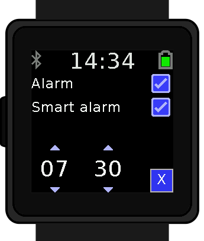
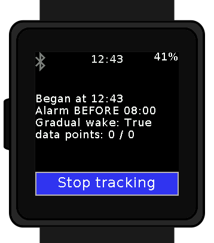
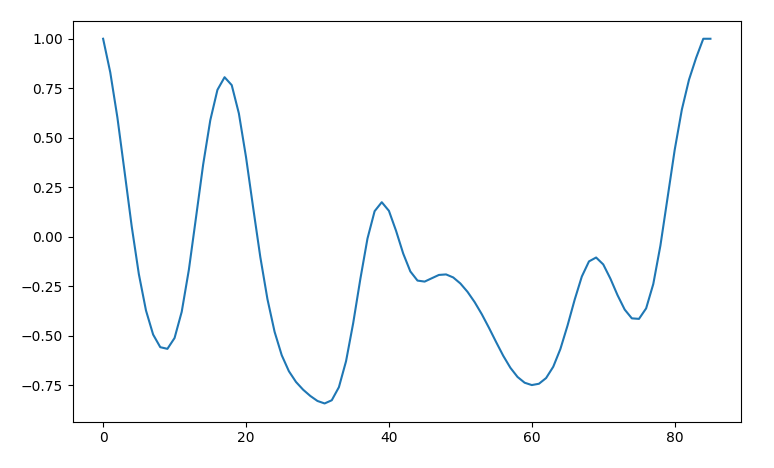

# SleepTk : a sleep tracker and smart alarm for wasp-os
**Goal:** privacy friendly sleep tracker with smart alarm for the [pinetime smartwatch](https://pine64.com/product/pinetime-smartwatch-sealed/) by Pine64, on python, to run on [wasp-os](https://github.com/daniel-thompson/wasp-os).

## Features:
* **sleep tracking**: logs your movement during the night, infers your sleep cycle and write it all down in a `.csv` file
* **Flexible**: does not make too many assumption regarding time to fall asleep, sleep cycle duration etc. SleepTk tries various data to see what fits best for your profile. If you still want to customize things, all the hardcoded and commented settings are easily accessible at the top of the file.
* alarm clock: wakes you up at a specific time
* **gentle alarm clock**: vibrates the watch a tiny bit regularly before wake up time to lift you gently back to consciousness
* **smart alarm clock**: can wake you up to 40 minutes before the set time to make sure you wake up feeling refreshed.
* **privacy friendly**: your data is not sent to anyone, it is stored and analyzed directly on the watch (but you can still download if if needed)
* open source

## **How to install**:
*(for now you need my slightly forked wasp-os that allows to use accelerometer data)*
* download the latest [forked wasp-os](https://github.com/thiswillbeyourgithub/wasp-os)
* download the latest [SleepTk.py](./SleepTk.py)
* put the latest app in `wasp-os/wasp/apps/SleepTk.py`
* compile `wasp-os`: `make submodules && make softdevice && make BOARD=pinetime all && echo "SUCCESS"`
* upload it to your pinetime: `./tools/ota-dfu/dfu.py -z build-pinetime/micropython.zip -a XX:XX:XX:XX:XX:XX --legacy`
* reboot the watch and enjoy `SleepTk`
* *optional: download your latest sleep data using the script `pull_latest_sleep_data.py`*

### Note to reader:
* If you're interested or have any kind of things to say about this, **please** open an issue and tell me all about it :)
* Status as of end of February 2022: *UI (**done**), regular alarm (**done**), smart alarm (**mostly done but untested**)*
* you can download your sleep data file using the file `pull_latest_sleep_data`. A suggested workflow to load it into [pandas](https://pypi.org/project/pandas/) can be found at the bottom of the page.
* the notifications are set to "silent" during the tracking session and are restored to the previously used level when the alarm is ringing

# Screenshots:





## TODO
**misc**
* log heart rate data every X minutes
* show settings panel after clicking start, instead of a swipe menu
    * add a Button instead of checkbox to manage alarm / gentle alarm / smart alarm / both
        * recommend best wake up time when setting up alarm
* investigate if downsampling is necessary
* if self.foreground is called, record the time. Use it to cancel smart alarm if you woke up too many times (more than 2 times in more than 20 minutes apart).
* add a "nap tracking" mode that records sleep tracking with more precision
* add a power nap mode that wakes you as soon as there has been no movement for 5 minutes OR (like steelball) when your heart rate drops

* log smart alarm data to file? log user rating of how well he/she felt fresh at wake?
* ability to send in real time to Bluetooth device the current sleep stage you're probably in. For use in Targeted Memory Reactivation?

## Related links:
* article with detailed implementation : https://www.nature.com/articles/s41598-018-31266-z
* very interesting research paper on the topic : https://academic.oup.com/sleep/article/42/12/zsz180/5549536
* maybe coding a 1D convolution is a good way to extract peaks
* list of ways to find local maxima in python : https://blog.finxter.com/how-to-find-local-minima-in-1d-and-2d-numpy-arrays/ + https://pythonawesome.com/overview-of-the-peaks-dectection-algorithms-available-in-python/
* interesting study : https://ieeexplore.ieee.org/document/7052479

### Related project:
* another hackable smartwatch has a similar software: [sleepphasealarm](https://banglejs.com/apps/#sleepphasealarm) and [steelball](https://github.com/jabituyaben/SteelBall) for the [Banglejs](https://banglejs.com/)


## Pandas integration:
Commands the author uses to take a look a the data using pandas:

```
fname = "./logs/sleep/YOUR_TIME.csv"

import pandas as pd
import plotly.express as plt

df = pd.read_csv(fname, names=["motion", "elapsed", "x_avg", "y_avg", "z_avg", "battery"])
start_time = int(fname.split("/")[-1].split(".csv")[0])

df["time"] = pd.to_datetime(df["elapsed"]+start_time, unit='s')
df["human_time"] = df["time"].dt.time

month = df.iloc[0]["time"].month_name()
dayname = str(df.iloc[0]["time"].day_name())
daynumber = str(df.iloc[0]["time"].day)
if daynumber == 1:
    daynumber = str(daynumber) + "st"
elif daynumber.endswith("2"):
    daynumber = str(daynumber) + "nd"
elif daynumber.endswith("3"):
    daynumber = str(daynumber) + "rd"
else:
    daynumber = str(daynumber) + "th"
date = f"{month} {daynumber} ({dayname})"

fig = px.line(df,
              x="time",
              y="motion",
              labels={"motion": "Body motion", "time":"Time"},
              title=f"Night starting on {date}")
fig.update_xaxes(type="date",
                 tickformat="%H:%M"
                 )
fig.show()
```

Now, to play around with the signal processing function:
```
import array
data = array.array("f", df["motion"])
data = data[:15] # remove the last few data points as the signal
# processor does not yet have access to them when finding best wake up time


##############################################
### PUT LATEST SIGNAL PROCESSING CODE HERE ###
##############################################


from matplotlib import pyplot as plt
plt.plot(data)
for i in x_maximas:
    plt.axvline(x=i,
                color="red",
                linestyle="--"
                )
plt.show()
```
